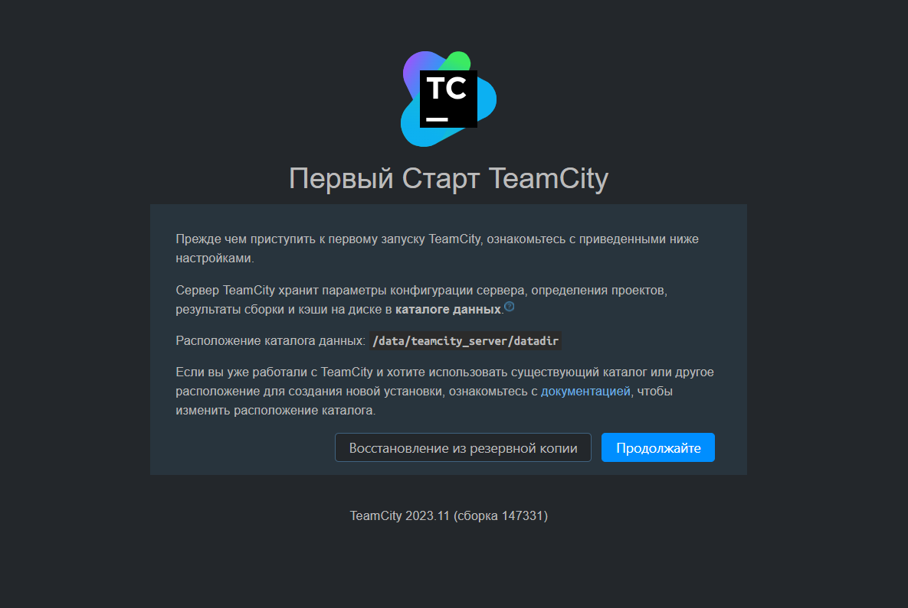
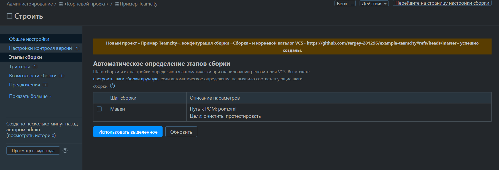
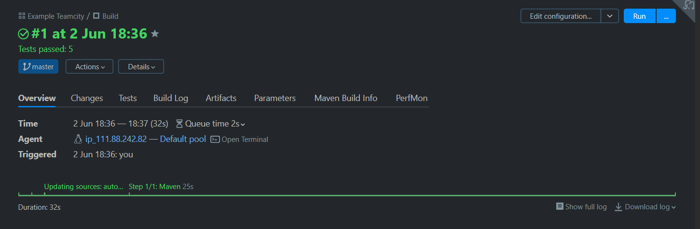
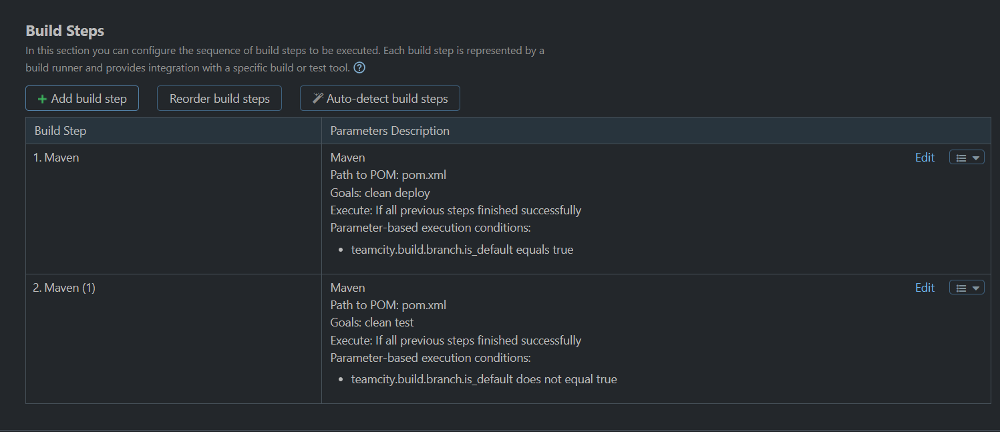

# Пример настройки TeamCity для CI/CD

В этом репозитории представлен пример настройки непрерывной интеграции и доставки (CI/CD) с использованием **TeamCity** и **Maven**.

## 🎯 Цель задания
Настроить автоматическую сборку Java-проекта в зависимости от ветки Git:
- Ветка **master**: выполнение `mvn clean deploy` (развертывание артефактов в Nexus).
- Остальные ветки (feature): выполнение `mvn clean test` (только тестирование).

## ⚙️ Настройки TeamCity

### 1. Условия выполнения шагов сборки
Настроены два шага Maven с условиями на основе параметра `teamcity.build.branch.is_default`:

| Шаг | Цели | Условие выполнения |
| :--- | :--- | :--- |
| **Maven (Deploy)** | `clean deploy` | `teamcity.build.branch.is_default` **равно** `true` (только master) |
| **Maven (Test)** | `clean test` | `teamcity.build.branch.is_default` **не равно** `true` (feature-ветки) |

### 2. Интеграция с Nexus Repository
Для успешного деплоя в приватный репозиторий Nexus был загружен файл `settings.xml` с учетными данными.

- Файл настроек загружен в раздел **Maven Settings** под именем `NexusSettings`.
- Настройки привязаны к шагу сборки `clean deploy`.

## 🚀 Результат работы

После настройки условий и запуска сборки в ветке `master`:
- Сборка успешно завершается (статус **Success**).
- Артефакты готовы к публикации (в данном примере шаг deploy был временно отключен из-за сетевых ограничений, но конфигурация полностью готова к работе).

##  Технологии
- **TeamCity Professional 2023.11**
- **Maven 3.6.3**
- **Java 11**
- **Git** (VCS)
